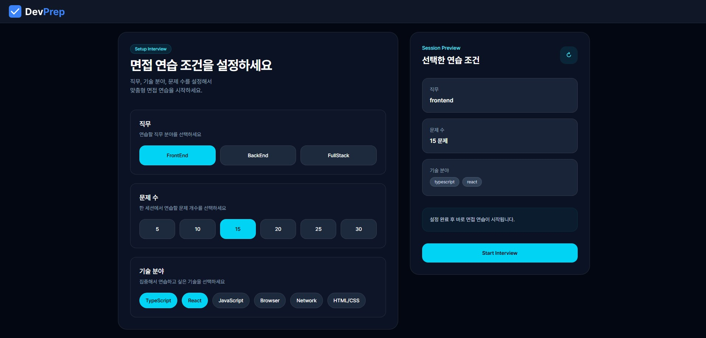
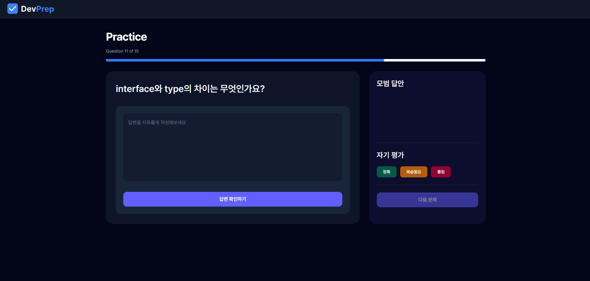
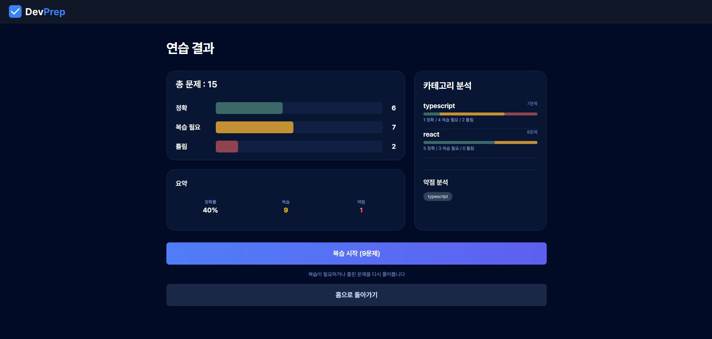

# 🎯 DevPrep

> 프론트엔드 기술 면접 학습을 위한 문제 풀이 및 자기 평가 기반 학습 웹 서비스

React와 TypeScript를 활용해 제작한 기술 면접 학습 서비스입니다.

기술과 문제 수를 선택해 학습 세션을 생성할 수 있으며, 문제 풀이 후 자기 평가를 기록하고 결과를 분석할 수 있습니다. 또한 복습이 필요한 문제만 다시 풀 수 있는 Review 모드를 제공하여 반복 학습이 가능하도록 구성했습니다.

🔗 **Live Demo**
https://devprep-project.netlify.app

---

## 📸 화면 미리보기

### 메인 화면



기술과 문제 수를 선택해 학습 세션을 생성할 수 있습니다.

### 문제 풀이



문제를 확인하고 자기 평가(정확 / 복습 필요 / 틀림)를 기록할 수 있습니다.

### 결과 분석



카테고리별 통계와 약점 기술 분석 결과를 확인할 수 있습니다.

---

## 🧭 프로젝트 기획 의도

기술 면접을 준비하면서 문제를 읽고 답을 정리하는 것만으로는 어떤 기술에 약한지 파악하기 어렵다고 느꼈습니다.

그래서 문제 풀이뿐 아니라 자기 평가, 결과 분석, 오답 복습까지 하나의 흐름으로 관리할 수 있는 학습 서비스를 만들어보고자 했습니다.

---

## 🚀 주요 기능

* 기술 및 문제 수 선택 후 학습 세션 생성
* 문제 풀이 후 자기 평가(정확 / 복습 필요 / 틀림) 기록
* 카테고리별 결과 통계 제공
* 약점 기술 분석
* 복습 필요 및 오답 문제만 다시 풀 수 있는 Review 모드
* 새로고침 후에도 학습 상태 유지

---

## 🛠 기술 스택

### Frontend

* React
* TypeScript
* React Router
* Tailwind CSS

### State Management

* Zustand
* Persist Middleware

### Deployment

* Netlify

---

## 📂 프로젝트 구조

```bash
src/
├── pages/
│   ├── HomePage
│   ├── SetupPage
│   ├── PracticePage
│   └── ResultPage
│
├── store/
│   ├── useInterviewStore
│   └── usePracticeStore
│
├── data/
│   └── questions
│
├── components/
│   ├── home/
│   │   ├── FeatureCards
│   │   └── InterviewPreview
│   │
│   └── layout/
│       ├── AppLayout
│       └── Header
│
└── router/
    └── index.tsx
```

---

## 🔄 학습 흐름

```text
Setup
 ↓
Practice
 ↓
Result
 ↓
Review Mode
```

사용자가 기술과 문제 수를 선택하면 학습 세션이 생성되고, 문제 풀이 결과를 기반으로 통계와 약점 분석을 제공합니다.

이후 복습 필요 또는 오답으로 분류한 문제만 다시 학습할 수 있도록 Review 모드를 구성했습니다.

---

## 🧩 설계 및 구현 과정에서 고민한 부분

### 1️⃣ Zustand Persist를 활용한 세션 관리

사용자가 문제를 풀던 중 새로고침을 하더라도 진행 상황이 유지되도록 Zustand Persist를 적용했습니다.

문제 목록, 현재 문제 위치, 풀이 기록을 저장하도록 구성했으며, 새로운 학습을 시작할 때는 이전 세션 데이터가 남지 않도록 상태 초기화 로직을 추가했습니다.

이를 통해 학습 도중 페이지를 벗어나더라도 이어서 진행할 수 있도록 구현했습니다.

---

### 2️⃣ 문제 배열 재생성으로 인한 순서 꼬임 문제

초기 구현에서는 문제 배열을 컴포넌트 내부에서 생성하고 있었습니다.

하지만 렌더링이 발생할 때마다 셔플 로직이 다시 실행되면서 현재 문제 index와 실제 문제 순서가 맞지 않는 문제가 발생했습니다.

원인을 확인해보니 문제 배열이 매 렌더링마다 새롭게 생성되고 있었고, useMemo를 사용해 문제 배열을 고정하는 방식으로 해결했습니다.

이를 통해 사용자가 보고 있는 문제와 현재 index가 항상 일치하도록 개선했습니다.

---

### 3️⃣ 학습 흐름을 고려한 페이지 접근 제어

Result 페이지는 학습을 완료한 뒤에만 접근할 수 있도록 의도했지만, URL을 직접 입력하면 접근이 가능했습니다.

이를 해결하기 위해 세션 정보와 풀이 기록 존재 여부를 확인하는 가드 로직을 추가했고, 조건을 만족하지 않을 경우 Setup 페이지로 이동하도록 구현했습니다.

이를 통해 Setup → Practice → Result 흐름이 유지되도록 구성했습니다.

---

### 4️⃣ 문제 데이터와 풀이 기록 분리

초기에는 문제 정보와 사용자 평가 결과를 하나의 상태에서 관리했습니다.

하지만 Review 기능을 구현하는 과정에서 문제 데이터와 사용자 기록의 역할이 다르다는 점을 확인했습니다.

이후 문제 데이터와 풀이 기록을 분리해 관리하도록 구조를 변경했고, Result 페이지의 통계 계산과 Review 모드 구성 과정이 단순해졌습니다.

---

## 📈 향후 개선 계획

* 문제 데이터 확장
* 검색 기능 추가
* 사용자 계정 기능 도입
* 학습 기록 저장 기능 추가
* 통계 기능 고도화
* UI/UX 개선

---

## 🧑‍💻 개발자

프론트엔드 기술 면접을 준비하며 직접 필요성을 느낀 기능들을 구현해본 프로젝트입니다.

상태 관리, 학습 흐름 설계, 페이지 접근 제어 과정에서 발생한 문제들을 직접 해결하며 개발했습니다.
